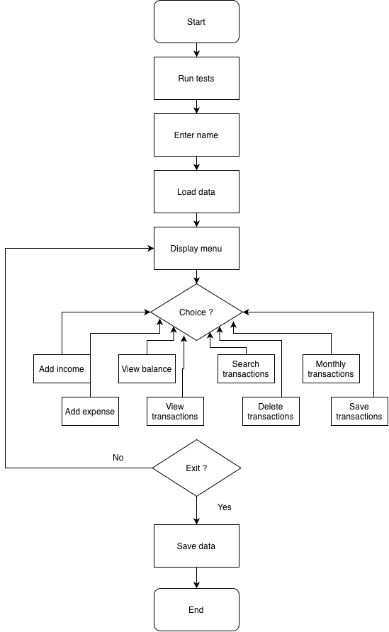
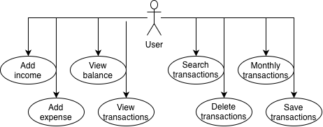

# CS1400-Final-Project
# Budget Tracker

## Ultimate aspiration for the project
My ultimate goal for this project was to create a useful budget tracker that could help users organize their personal finances. I wanted the program to allow users to record income and expenses, view their current balance, review their transaction history and create monthly reports. I also wanted the program to save information so that transactions would still be available after closing and reopening the application.
As the project developed, I made it so different users could use the program. Each user enters their name and receives a separate transaction file. This allows multiple people to use the same program without mixing their financial information.

## Why the project is interesting to me
I chose a budget tracker because managing money is something that is useful in everyday life. I liked the idea of creating a program that could solve a real problem that people around me, even mysfelf, experience. The project interested me because it combined several concepts from the course, including methods, classes, lists, loops  and file handling.
This project also allowed me to see how several smaller methods can work together to create one complete application. Each feature has a separate purpose, but they all share the same transaction list and balance.

## Portion attempted and completed
For this submission, I completed a menu-based console budget tracker. The program allows users to:
- Add income transactions
- Add expense transactions
- View their current balance
- View all transactions
- Search transactions by description
- Delete selected transactions
- Generate a report for a selected month and year
- Save transactions to a text file
- Automatically load saved transactions when the program begins
- Validate integer and decimal input
- Store separate transaction files for different users

I also added comments throughout the code and automatic tests using debug.Assert. The tests verify the balance calculation method and the month-validation method.

## Reflection on what I learned
This project helped me understand how to divide a larger program into smaller methods. At the beginning, it was difficult to determine how all the features should connect, especially when updating the balance and saving transaction information. Creating separate methods made the program easier to understand and modify.
I also learned more about passing values by reference. I used ref when a method needed to update the original balance stored in Main. I gained more experience using a list of objects and creating a Transaction class to keep related information together.
File handling was another important part of the project. I practiced how to write transaction information to a text file and read it back into the program. I also learned how input validation with TryParse can prevent the program from crashing when a user enters invalid input.
Finally, adding automatic tests helped me understand that testing is not only about running the entire program manually. A test can give a method a known input and confirm that it returns the expected result. Overall, this project helped me become more confident working with methods, classes, lists, loops, files and debugging.

## Diagrams

### Flowchart

## Pseudo code

START 
Run automatic tests 
Ask user for name 
Load user's transaction file 
DO 
	Display menu 
	Get user choice 
	IF choice = 1 
	    Add income 
	ELSE IF choice = 2 
	    Add expense 
	ELSE IF choice = 3 
	    View balance 
	ELSE IF choice = 4 
        View transactions 
    ELSE IF choice = 5 
        Search transactions 
    ELSE IF choice = 6 
        Delete transaction 
    ELSE IF choice = 7 
        Generate monthly report 
    ELSE IF choice = 8 
        Save transactions 
    ELSE IF choice = 9 
        Save transactions 
        Exit program 
    END IF 
WHILE choice is not 9 
END

## Use-case diagram

### Concepts Used

- Pass-by-reference (ref)
Used to update the balance directly in AddIncome, AddExpense, DeleteTransaction and LoadTransactions.

- List Collections
   Used List<Transaction> to store all transactions.

- If/Else
   Used for transaction type checks, validation and searching.

- Switch
   Used in the main menu to select program options.

- Methods
   Used separate methods for income, expenses, reports, saving, loading, searching, deleting and validation.

- While Loops
Used for input validation and reading file data.

- Do-While Loop
Used to repeatedly display the menu until Exit is selected.

- For Loop
Used when displaying transaction numbers for deletion.

- Foreach Loop
Used for viewing, saving, searching, and reporting transactions.

- File Handling
Used StreamReader and StreamWriter to load and save data.
